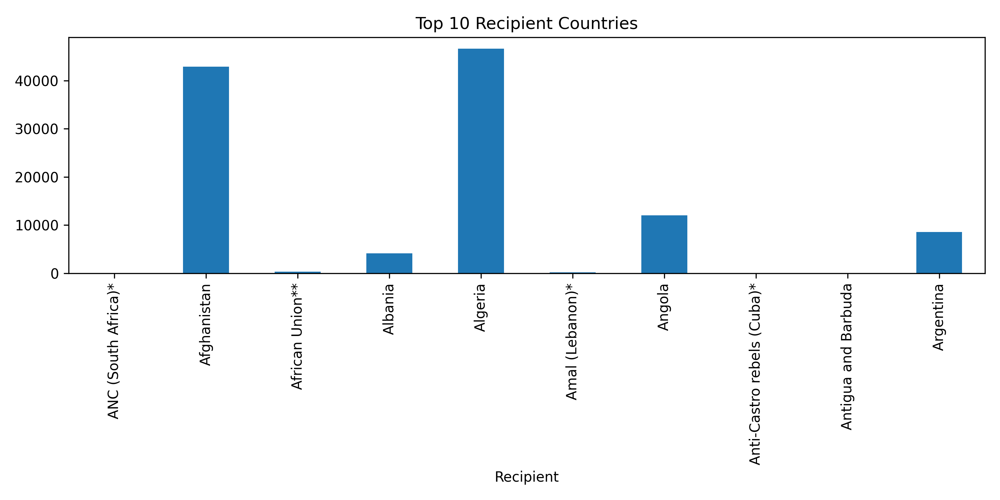
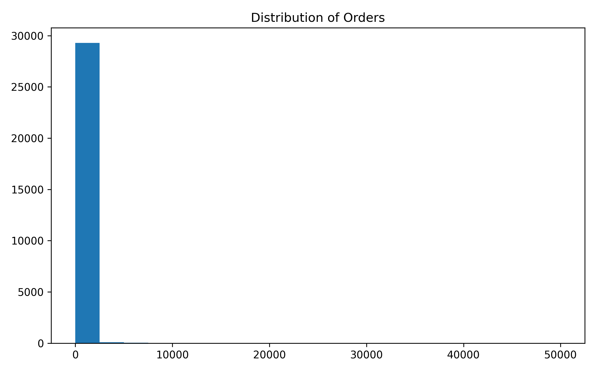
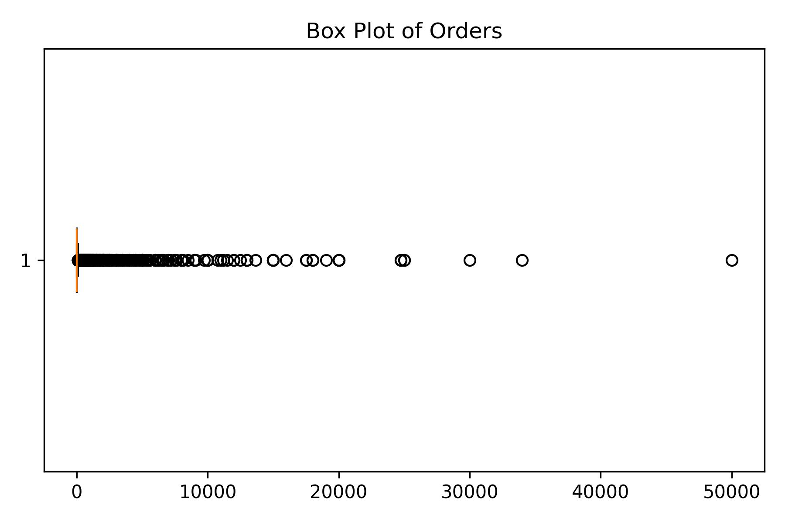
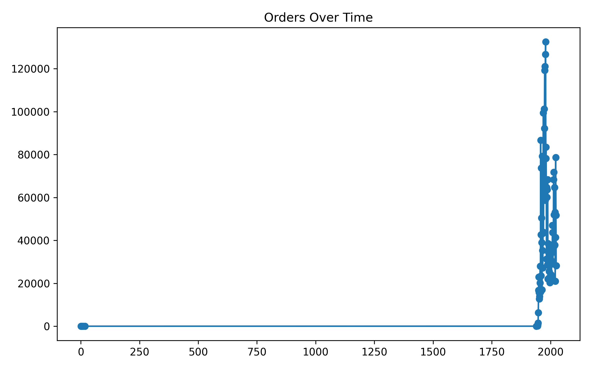
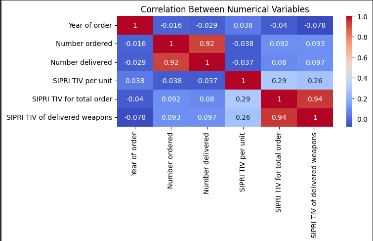
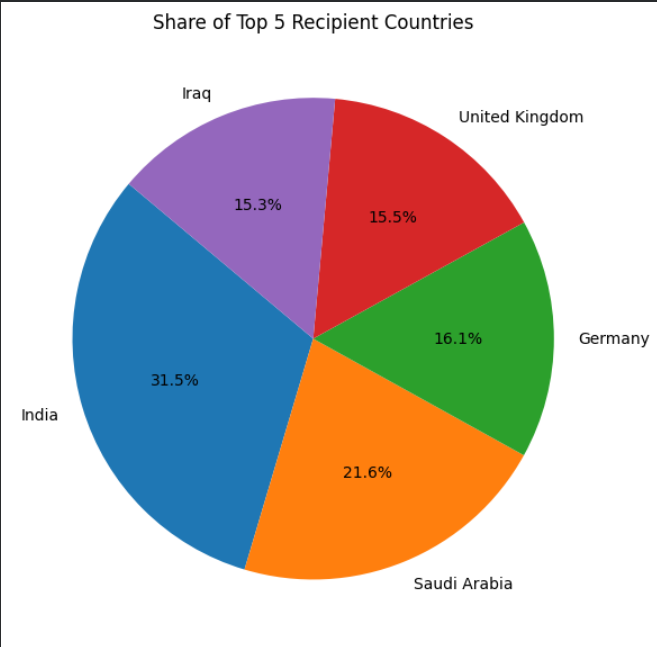
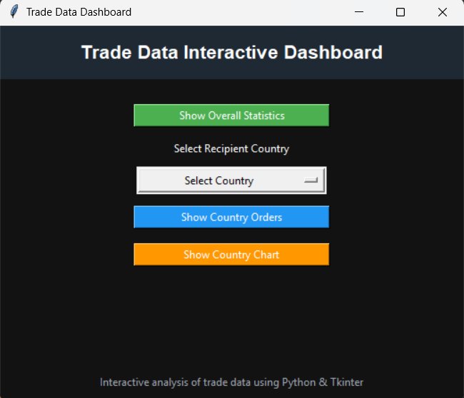

# Trade Register Data Analysis and GUI Dashboard

**SOFT40161 – Introduction to Computer Programming**  
Nottingham Trent University  

**Author:** Aditya Anil Kapile  
**NTU ID:** N1411721  

---

## Project Overview

This project analyses the SIPRI Arms Transfers dataset using Python to demonstrate core programming and data analytics skills.  
It implements a complete workflow including data inspection, preprocessing, statistical analysis, visualisation, and an interactive graphical user interface (GUI).

The project was developed as coursework for SOFT40161 and showcases practical application of Python programming concepts on a real-world dataset.

---

## Repository Structure

SOFT40161_Trade_Data_Project
│
├── SIPRI_Military.ipynb
├── gui_dashboard.png
├── data
│ └── trade-register.csv
├── plots
│ ├── bar_top10_countries.png
│ ├── hist_distribution.png
│ ├── boxplot_orders.png
│ ├── line_orders_over_time.png
│ ├── heatmap_correlation.png
│ └── pie_top5.png
└── README.md

---

## Dataset

**SIPRI Arms Transfers Database**  
https://www.sipri.org/databases/armstransfers  

The dataset records international transfers of major conventional weapons since 1950 and includes:

- Recipient country  
- Supplier country  
- Year of order and delivery  
- Number of weapons ordered and delivered  
- SIPRI Trend Indicator Values (TIV)

---

## Visualisation Results

### Top 10 Recipient Countries by Total Orders

### Distribution of Number Ordered

### Box Plot of Orders

### Orders Over Time

### Correlation Between Numerical Variables

### Share of Top 5 Recipient Countries

---

## GUI Dashboard

An interactive Tkinter dashboard was developed to enable user-driven exploration of the dataset.

**Features:**

- View overall dataset statistics  
- Select recipient country  
- View total orders for selected country  
- Display order distribution chart  

---

## How to Run the Project

1. Download or clone this repository  
2. Open the notebook:

SIPRI_Military.ipynb

3. Run all cells sequentially  

**Important:**  
The Tkinter GUI requires a local Python environment (Anaconda / desktop Jupyter).  
It cannot run in cloud notebook environments such as Google Colab due to lack of graphical display.

---

## Programming Concepts Demonstrated

- Exception handling  
- Iteration and conditional logic  
- Functions and modular design  
- Data cleaning and preprocessing  
- Aggregation and filtering with pandas  
- Statistical analysis  
- Data visualisation with matplotlib and seaborn  
- GUI development with Tkinter  

---

## Coursework Alignment

This project satisfies the SOFT40161 coursework requirements:

- Real-world dataset analysis  
- Python programming fundamentals  
- Data visualisation  
- Interactive GUI development  
- Version control using GitHub  

---

## Author

**Aditya Anil Kapile**  
NTU ID: N1411721  

---

*Educational use only — coursework submission.*
